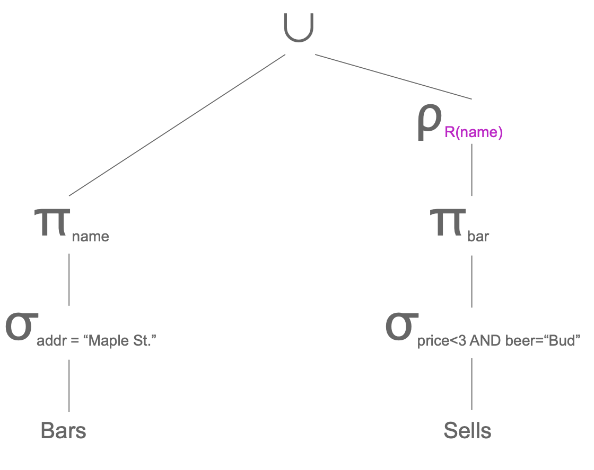

```{r Connection to University Database, message=FALSE, warning=FALSE, include=FALSE}
library(DBI)
library(RSQLite)
conn <- dbConnect(RSQLite::SQLite(), "databases/notes_database.db")

# Warning message:
# call dbDisconnect() when finished working with a connection 
```

# Relational Algebra
## Algebraic Query Language
SQL is built upon relational Algebra and is simplified for optimization and ease of use.  In relational algebra, relations are variables and finite relations are constants.  In other words, relations are the operands (things we apply operators to) in relational algebra.

When Database Management Systems (DBMS) process queries,  the first thing the system does is translate the queries into relational algebra or a very similar internal representation of it.

We will talk about the following operations in that can be done in relational algebra:

1. __Selection $\sigma_{C}{(R)}$__ - This operation chooses a subset of tuples.  $C$ is a set of conditions that determines which tuples are chosen and $R$ is the input of $\sigma$ that indicates which relation we want to execute the selection on.    
2. __Projection $\pi_{A_{1}, A_{2}, ...}$__ - This operation choose a subset of columns.  Each $A_{i}$ in the subscript is simply the attributes we want to project (select).  In relational algebra of sets, duplicate tuples are always removed.    
3. __Cartesian Products/Joins  $R \times S$__ - This concatenates two tuples together.  Conventionally, the attributes of in the left side of $\times$ are populated first.
4. __Renaming $\rho_{S{(A_{1}, A_{2}, ..., A_{n})}}{(R)}$__ - This changes the names of attributes or relations in the relation schema.  $R$ is the relation who's name we are trying to change, $S$ is the new name of $R$, and $A_{1}, A_{2},..., A_{n}$ are the attribute with their corresponding new names.  The attributes are listed in order of their definition in the relation's schema.  If you do not want to change some attributes, just list their current names in the subscript along with the new names of the attributes you wanted to change.

When joining relations together, we typically also apply the fundamental operations from set theory:   
1. __Unions $R \cup S$__ - This is the set of elements in R or S or both.  If an element appears in both, it is presented only once in union    
2. __Intersection $R \cap S$__ - This is the set of elements in both R and S    
3. __Difference $R - S$ (R not in S)__ - This is the set of elements in R, but not in S.  Note that this is different from $S - R$, which means the set of elements in S, but not in R.

When applying these operations to two tables, we implement some constraints:   
1. R and S must have schemas with identical attributes and the domains for each attribute must be the same in R and S   
2. Before doing any operations, the columns in R and S must be orderd so that the order of attributes are the same for both relations.  We cannot do operations on $R = \{Int, Char\}$ to $S = \{Char, Int\}$.  If attributes are identical between two relations, but they have different names, we can still apply this operations to the relations.  This is because we can just rename the attributes.

We will now go in more depth with each operation.

\

Before we talk about the various operations in relational algebra, we will define what a clause and predicate is.

__Clause__:  A clause is any function or keyword in SQL that allows you to filter tuples
__Predicate__:  A predicate is anything that returns a boolean (True, False, Unknown)

](images/clause_graph.png){width=100%}

## Selection
__Selection__ chooses which attributes we want in our relation.  For example:

```{sql Selection, connection=conn, max.print=5}
SELECT *
FROM instructor
```

The notation for selection is $\sigma_{C}({R2})$.  $C$ is the the set of conditions we may want to apply to the selection.  The input $R2$ is the relation we like to pull the attributes from. When committing any operator to a relation, we usually assign expression to a new relation.  For example:

$$
R1 := \sigma_{C}({R2})
$$

Here $R1$ is the new relation from the expression  $\sigma_{C}({R2})$.  $:=$ is an assignment operator that assigns $R1$ to be the relation returned from $\sigma_{C}({R2})$.  When creating relations from any expression, it will have the same schema as the inputted relation.  To put our expression in English, we are selecting all tuples.  We are not using any conditions to exclude tuples!

## Projection

__Projection__ selects a subset of attributes from a relation.  The order of attributes must be specified or the order of the relation from the schema is returned.  Any duplicates are eliminated.

$$
R1 := \pi_{L}({R2}) \\ \text{L - List of attributes from R2} \\ \text{In English - R1 is the the attributes "L" from R2}
$$

```{sql Projection, connection=conn, max.print=5}
SELECT name
  ,dept_name
  ,salary
FROM instructor
```


### Extended Projection
We can create attributes for a projection by applying operations to attributes.  Think of adding a constant to component of every tuple. or finding the difference between two columns as a new column.

For example:

$$
R = \begin{matrix}
A & B \\
\hline
1 & 2 \\
3 & 4
\end{matrix}
\qquad \text{Some relation } R
\\~\\~\\ % ~ is an operartor to add multiple new lines
R2 := \pi_{A+B\rightarrow{C}, A, B}({R}) \qquad \text{Assigning a new relation } R2 \text{ with  columns } A, B, C
\\~\\
C \text{ is a column generating in the projection by the expression } A + B \rightarrow{C}
\\~\\
R2 = \begin{matrix}
A & B & C \\
\hline \\
1 & 2 & 3 \\
3 & 4 & 7 \\
\end{matrix}
$$

\

## Cartesian Products and Joins
### Cartesian Product
Other names for cartesian product are "product" or "Cross product".  To denote the cartesian product for two relations, we use $\times$

For example:

$$
R3 := R1 \times R2
\\~\\
\text{In English, R3 is assigned to be the cartesian product of } R1 \text{ and } R2
$$

Cartesian product simple takes the the attributes in the left hand of $\times$ and concatenates it with the attributes in the right hand of $\times$.  The attributes in the left hand side appear first by convention.  If an attribute name appears in both relations, you must rename them.  $R3$ has the schema of both $R1$ and $R2$.

### Natural Joins
Natural Joins connect two relations by doing the following:

- Check which attributes in the schemas for both relations have the same name and domain
- For each tuple in one relation, compare the same attributes to the tuples in the other relation
- If both tuples have equal values for all shared attributes, concatenate the tuples!
  - If at least one of the shared attributes do is not equal in both tuples, reject the join of those tuples!
  - Any tuple that cannot join is known as a __dangling tuple__
- Any tuples shared attributes only appear once in the tuples (no duplicate attributes)

Natural joins are denoted as $\bowtie$

Lets take the following for an example:

Suppose we have two relations

$$
Sells = \begin{matrix}
bar & beer & price \\
\hline
Joe's & Bud & 2.50 \\
Joe's & Miller & 2.75 \\
Sue's & Bud & 2.50 \\
Sue's & Coors & 3.00
\end{matrix} \qquad Bars = \begin{matrix}
bar & address\\
\hline
Joe's & \text{Maple Street }\\
Sue's & \text{River Road} \\
\end{matrix}
$$

Lets join them!

$$
BarInfo := Sells \bowtie Bars
\\
\text{In English: Relation BarInfo is Sells natural join Bars}
\\~\\
BarInfo = \begin{matrix}
bar & beer & price & address \\
\hline \\
Joe's & Bud & 2.50 & \text{Maple Street} \\
Joe's & Miller & 2.75 & \text{Maple Street} \\
Sue's & Bud & 2.50 & \text{River Road} \\
Sue's & Coors & 3.50 & \text{River Road} \\
\end{matrix}
$$

### Theta Joins
A theta join is a cartesian product with a condition.  You simply commit a cartesian product that removes tuples based on some set of conditions.  The notation for a theta join is $\sigma_{C}$ where $C$ is the set of conditions.  Theta joins are called theta joins because historically, we used $\theta$ instead of $C$ to represent the set of conditions.

For example:

$$
R1 = \begin{matrix}
A & B \\
\hline
1 & 2 \\
3 & 4
\end{matrix} \qquad
R2 = \begin{matrix}
B & C \\
\hline
5 & 6 \\
7 & 8 \\
9 & 10
\end{matrix}
\\~\\~\\
R1 \times R2 = \begin{matrix}
A & R1.B & R2.B & C \\
\hline
1 & 2 & 5 & 6 \\
1 & 2 & 7 & 8 \\
1 & 2 & 9 & 10 \\
3 & 4 & 5 & 6 \\
3 & 4 & 7 & 8 \\
3 & 4 & 9 & 10 \\
\end{matrix}
\\~\\~\\
R5 := R1 \times_{A + C < 10 \text{ and } A < 2} R2
\\~\\
R5 = \begin{matrix}
A & R1.B & R2.B & C \\
\hline
1 & 2 & 5 & 6 \\
1 & 2 & 7 & 8 \\
3 & 4 & 5 & 6
\end{matrix}
$$


### Self Joins
__PLEASE FIND EXAMPLE OF SELF JOIN IN TEXTBOOK__

## Renaming
The rename operation simply renames relations or its attributes.  After renaming a relation, the returned relation retains its tuples, but with different names.  The notation for the renaming operation is

$$
\rho_{S(A_{1}, A_{2}, ...A_{n})}{(R)}
\\~\\
S: \text{ The relations new name} \qquad A_{i}: \text{ The new names of the relations attributes}
\\~\\
(R): \text{ The relation you are renaming}
$$

__Note__:

* If no attributes are in the subscript, then you are only renaming the relation
* If you are renaming at least one attribute, you must list all attributes in the order it appears in the schema with their new names if they are suppose to be renamed and their current names if they are not to be renamed


## Complex Expressions
Like in algebra, you can combine expressions to create complex expressions!

There are three ways to express relation arithmetic:

1. Sequences of assignment statements
2. Expressions with multiple operators
3. Expression Trees

In regular algebra, we have an order of precedence of operations (PEMDAS).  Likewise, the order of precedence of operations in relational algebra is as follows

1. Selection, Projection, Renaming - $\sigma, \pi, \rho$ 
2. Natural joins/Cartesian Products - $\times, \bowtie$
3. Intersections - $\cap$
4. Unions, Difference $\cup, -$

We will now explore the different methods of expressing relational arithmetic.

<!-- Continue on slide 31 of relational algebra lecture -->

### Sequence (Order) of Operations
We can rewrite the expression $R3 := R1 \bowtie_{C} R2$ as a sequence of small expressions:

1. $R4 := R1 \times R2 \qquad \text{Commit a cartesian product}$
2. $R3 := \sigma_{C}{(R4)} \qquad \text{Commit a seleciton}$

### Expression Trees
Using the relations $Bars(name, addr)$ and $Sells(bar, beer, price)$, find the names of all the
bars that are either on Maple St. or sell Bud for less than $3.

We can express the example expression as a tree where each leaf node is a relation and each parent node is an operation.  The head of the tree is the new relation! 

{width=100%}

We can see in the left hand side of the tree that our relation (leaf node) is $Bars$, we then do a selection.  Finally we do a projection!  The right hand side does the same.  As we traverse the tree, we finally join both sides with a union

### Schemas for Results
How do relations created by relational algebra affect their schemas?

* __Union, intersection, difference__:  The schemas of two oprands must be identical,  therefore that schema becomes the schema for the result
* __Selection__:  The schema of the result is the same as the schema of the operand
* __Projection__:  The chosen attributes become the schema
* __Cartesian Product__:  The schema is the attributes of both relations in the product (Use  __RelationName__.attribute) for common attributes
* __Thea Join__: The schema is the attributes of both relations in the product (Use  __RelationName__.attribute) for common attributes
* __Natural Join__: The union of the two attributes of the relation with no repeats in shared attributes.
* __Renaming__: the operator tells the schema

\

## Relational Algebra on Bags
A __bag__ is a set with duplicate values  The normal mathematical sets are a special case of bags where all elements in the bag are

### Operations on Bags
__Selection__:  Selection chooses tuples, so it works exactly like selection in sets

__Projection__:  Like projection of sets, chosen attributes become the schema, but duplications are not removed

__Cartesian Product/joins__:  This is the same as regular sets, however duplicates are not removed

__Bag Union__:  In the union of bags, duplicates are not removed

__Bag Intersection__:  In the intersection of bags, duplicates are not removed

__Bag Difference__:  The elements that appear in a difference of bags $A - B$ is the the same as sets, but you treat each element (even if they are duplicates) as its own entity

<!--- Look up PC example!--->