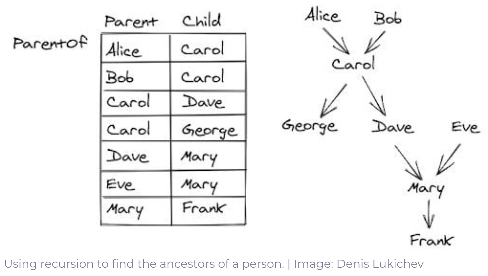
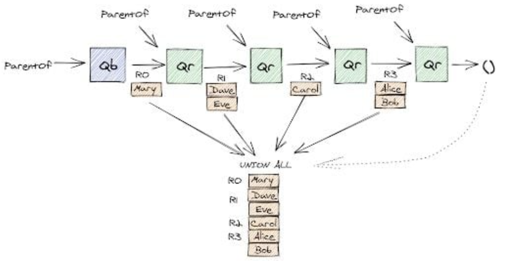

# Introducion to SQL
## Partition of the SQL language
The current standard for SQL is __SQL-99__.  There are two aspects to the SQL language:    
1. The __Data Definition Language (DDL)__ to declare database schemas    
2. The __Data Manipulation Language (DML)__ sub-language for querying/modifying databases 

### Why SQL?
SQL is a high level language.  When using SQL, we simply ask “what to do” rather than “how to do it.”.  This allows to disregard complex data manipulation and DBMS utilize _query optimizations_ to optimize queries.

## Relations in SQL
SQL makes a distinction between three kinds of relations:   
1. __Stored relations__, which are called __tables__    
2. __Views__, which are relations designed by some computation.  These relations are not stored in memory, but constructed when needed   
3. __Temporary Tables__ which are constructed by the SQL language processor when executing queries and data modifications.  These relations are not stored in memory and discarded when no longer used.   

Before we dive into operations in SQL, we will go over the order of execution for any query.  The order of execution for any query is as follows

1. `FROM`
2. `JOIN`
3. `WHERE`
4. `GROUP BY`
5. `HAVING`
6. `SELECT`
7. `ORDER BY`
8. `LIMIT`

This is also the meaning of a _single relation query_

To declare a schema for a stored relation, do the following

```sql
CREATE TABLE MovieStar( -- CREATE TABLE Initializes the create of the MovieStar schema
  name CHAR(30)         -- For every attribute, declare its data type
  ,address CHAR(30)
  ,gender char(1)
  ,birthdate date
,PRIMARY KEY (name)  -- Assign the name attribute as the primary key for the schema
);
```


## Foreign Keys
A foreign key is designed to create a relationship between two or more relations utilizing attributes that are similar to each other.  We say "similar"because  these attributes can have different names for each relation.  Foreign keys reference primary keys or "unique" attributes from other relations.

The table that contains a foreign key is referencing an attribute from another table.  The relations with the foreign key is the _referencing table_ while the relation that the referencing relation is referring to is known as the _referenced table_.  There is no constraint to how many foreign keys a table may have, as long as they define a relationship to another relation.

There are two ways to declare a column to be a foreign key.  Both use the keyword `REFERENCE`.

```sql
CREATE TABLE Student(
  id VARCHAR(5)
  ,name VARCHAR(20) NOT NULL
  ,dept_name VARCHAR(20)
  ,tot_cred NUMERIC(3, 0) -- 3 indicates the total # of digits allowed for the float while 0 indicates the number of digits allowed after the decimal point
  ,PRIMARY KEY (id)
  ,FOREIGN KEY (dept_name) REFERENCES department
);

-- This needs to be reviewed
```

## SELECT, FROM, WHERE Statements
- `SELECT`:  Chooses a subset of tuples
- `FROM`:  Chooses which relation to pull data from
- `WHERE`:  Choose tuples based on conditions

## Relation Schema Modification
### Deleting Relations
This is how we can delete relations

```sql
DELETE -- Some Table

-- We can also do this
DELETE FROM -- Some Table
```

### Altering Tables
This is how we alter tables

```sql
-- Adding a attribute "surname" to Instructor1 --
ALTER TABLE Instructor1 ADD surname CHAR(100);

-- Dropping surname from Instructor1 --
ALTER TABLE Instructor1 DROP surname;

-- Renaming department attribute to dept from Instructor
ALTER TABLE Instuctor RENAME COLUMN Department TO dept;

-- Renaming relation Instructor to "Teacher"
ALTER TABLE Instuctor RENAME TO Teacher;
```

\

## SELECT
`SELECT` chooses the attributes that you want in your query.  It corresponds to the projection operator $\pi_{C}{(R)}$.  In SQL, names of relations and attributes are not case sensitive.  In practice, any keywords should be capitalized.

For example:

```{sql SELECT Example, connection=conn, output.var='03-selectOutput'}
-- Using the SELECT clause to grab the name attribute! --
SELECT name
FROM instructor;
```
```{r select output, echo=F, out.width='100%'}
createTable(`03-selectOutput`)
```

A short handed way to project all attributes from a relation is by using an asterisk `*`.

```sql
-- Return all attributes for all tuples with manf=Anheuser-Busch
SELECT *
FROM Beers
WHERE manf='Anheuser-Busch';
```

SQL is an interpreted language (like python).  Therefore code gets executed line by line!  Likewise each tuple in a relation gets evaluated one at a time to see if it should be returned in the output relation.

For example, suppose we have the following query:

```sql
-- Grabbing the 'name' attribute from Beers --
SELECT name
FROM Beers
WHERE manf='Anheuser-Busch';
```

For every tuple, the name component is being evaluated.  If the component has the value "Anheuser-Busch", then tuple is returned in the new relation!

{width=100%}

We can also add new attributes using the attributes from the relation we are retrieving data from.

```sql
SELECT bar,
  ,beer
  ,price*114 AS PriceInYen
FROM Sells;
```

### DISTINCT/ALL
SQL allows for duplicate tuples, therefore, to return strictly unique tuples, you can use the `DISTINCT` clause.

For example:

```{sql DISTINCT Example,  connection=conn, output.var='03-distinctOutput'}
-- Grabbing the unique department names from Instructor --
SELECT DISTINCT dept_name
FROM Instructor;
```
```{r DISTINCT output, out.width='100%', echo=F}
createTable(`03-distinctOutput`)
```

In contrast, the SQL keyword `ALL` allows you to explicitly state that duplicates should not be removed.

```{sql ALL Example,  connection=conn, output.var='03-allExample'}
-- Grabbing all instances of dept_name attribute from Instructor --
SELECT ALL dept_name
FROM Instructor;
```
```{r ALL output, echo=F, out.width='100%'}
createTable(`03-allExample`)
```
The rest of the examples in this section will use the following relations

$$
Beers(\underline{name}, manf) \\
Bars (\underline{name}, addr, license) \\
Drinkers(\underline{name}, addr, phone) \\
Likes(\underline{drinker}, {beer}) \\
Sells(\underline{bar}, {beer}, price) \\
Frequents(\underline{drinker}, {bar})
\\~\\
\text{Note: underlined attributes indicate keys}
$$
<!--- Must review this example --->
Here is another example using `All`.

Using `Frequents` and `Likes`, list all drinks who go to a higher number of different bars than they like different beers and does so as many times as the difference of those counts.

```sql
SELECT drinker
FROM Frequents

EXCEPT ALL

SELECT drinker
FROM Likes;
```

In this query, `EXCEPT` returns distinct rows from the top query that are not in the bottom query.  

Here is another example using `DISTINCT`.
From `Sells`, find the different prices charged for beers

```sql
SELECT DISTINCT price
FROM Sells;
```

If distinct was not used, then your output relation would see duplicates of prices!

### SELECT and Literals
You can assign relations to contain only literals (any primative data type).

For example:

```{sql SELECT Literal, connection=conn, tab.cap="Literals"}
-- Selecting a literal --
SELECT '437' AS Literal;
```

Here we have returned a $1 \times 1$ relation with an attribute name `Literal` with a value of "437".

If we add `FROM`, to the query, we will have an $n\times{1}$ relation for $n$ tuples in the relation we are referencing in `FROM`.

```{sql SELECT Literal Example 2, connection=conn, output.var='03-literalExample'}
-- Selecting a literal with FROM --
SELECT '437' AS Literal
FROM instructor;
```
```{r Literal Output, echo=F, out.width='100%'}
createTable(`03-literalExample`)
```


## WHERE
The `WHERE` clause specifies conditions must pass for a tuple to be returned.  You can use comparators and logical connectives (`AND`, `OR`, `<`, `<=`, `>`, `>=`, `=`, `<>`).

For example, we will select all instructors from the Computer Science department who have a salary greater than $80,000

```{sql WHERE Example, connection=conn, output.var='03-whereExample'}
-- SELECTING CS Instructors who make that bread --
SELECT name
FROM Instructor
WHERE dept_name='Comp. Sci.';
```
```{r WHERE Output, echo=F, out.width='100%'}
createTable(`03-whereExample`)
```

## FROM Clause with Multiple Relations
`FROM` allows you to choose where you are sourcing your data.  This clause corresponds to the Cartesian Product in relational algebra.

For example, the following returns the cartesian product $Instructor \times Teaches$

```{sql FROM Example, connection=conn, output.var='03-fromExample'}
-- Cartesian Product Of Instructor and Teaches --
SELECT *
FROM Instructor, Teaches;
```
```{r 03-fromExample, echo=F, out.width='100%'}
createTable(`03-fromExample`)
```


If there is a naming conflict between attributes of different relations, you must explicitly rename the attributes.

For example

```{sql FROM Naming Conflict Example, connection=conn, output.var='03-fromNamingConflict'}
-- Renaming attributes with the same name --
SELECT name
  ,instructor.dept_name AS dept1
  ,salary
  ,department.dept_name AS dept2
  ,building
FROM instructor, department
WHERE instructor.dept_name=department.dept_name;
```
```{r 03-fromNamingConflict, echo=F, out.width='100%'}
createTable(`03-fromNamingConflict`)
```

## RENAME
Using `AS`, we can rename relations and attributes

```{sql Renaming Example, connection=conn, output.var='03-renameExample'}
SELECT DISTINCT T.name
FROM Instructor AS T, Instructor AS S -- WE have two copies of Instructors!
WHERE T.salary > S.salary AND
  S.dept_name='Comp. Sci.';
  
-- We use DISTINCT because the cartesian product of relation and a copy of itself create's duplicates!
```
```{r 03-renameExample, echo=F, out.width='100%'}
createTable(`03-renameExample`)
```

## Patterns
We can compare strings in a query that follow some pattern using wild cards (`%`, `_`).  `%` means "any string" while `_` means any character.

For example:
```{sql Wildcard Example, connection=conn, output.var='03-wildcardExample'}
-- Using Wild cards to find patterns in name attribute --
SELECT *
FROM Instructor
WHERE name LIKE 'Mc%'; -- Look for any string beginning wiht "Wu"
```
```{r 03-wildcardExample, echo=F, out.width='100%'}
createTable(`03-wildcardExample`)
```


Using `LIKE` in conjunction with a wild card.  We return any tuple that is follows the pattern expressed with the wild card.

## Null
Its possible for a component in a tuple to not have a value.  DBMS' use the keyword `NULL` to indicate that there is a value does not exist for a component.  Any arithmetic operation that deals with a component with `NULL` returns `UNKNOWN`.

```{sql Arithmetic Null Example, connection=conn, output.var='03-nullArithmeticNull'}
-- NULL Arithmetic --
SELECT NULL + 1 AS null_arithmetic;
```
```{r 03-nullArithmeticNull, echo=F, out.width='100%'}
createTable(`03-nullArithmeticNull`)
```

The predicate `IS NULL` or `IS NOT NULL` can check if a component is or is not `NULL`.

SQL contains 3 boolean values for comparators.  These are (`TRUE`, `FALSE`, `UNKNOWN`).  `UNKNOWN` is used to help handle `NULL` values.  Therefore when using `AND`, `OR`, & `NOT`, we must update the logic to handle `UNKOWN`.

The following is the logic for these operators:

| Logic | Output |
|:-----:|:------:|
| `TRUE AND UNKNOWN` | `UNKNOWN` |
| `FALSE AND UNKNOWN` | `FALSE` |
| `UNKNOWN AND UNKNOWN` | `UNKNOWN` |
| `TRUE OR UNKNOWN` | `TRUE` |
| `FALSE OR UNKNOWN` | `UNKNOWN` |
| `UNKNOWN OR UNKNOWN` | `UNKNOWN` |

When using the `WHERE` clause, any boolean comparators that yields `UNKNOWN` returns `FALSE`

When working with `WHERE` to subset tuples.  Only tuples that yield `TRUE` are returned.  Any tuples that yield `FALSE` OR `UNKNOWN` are not returned.


## Multiple Relational Queries
In practice, we typically source data from multiple relations.  We can describe data from multiple relations by referencing the relations in the `FROM` clause.  We distinguish attributes with the same name by `<relation>.<attribute>`

For example:

```sql
-- SELECTING BEER BASED ON DATA FROM Frequents and Likes --
SELECT beer                            -- Project beer attribute
FROM Likes, Frequents                  -- State we want data from Likes and Frequents (Cartesian Product)
WHERE bar = ’Joe’’s Bar’ AND           -- Select based on bar = "Joes Bar" and the drinkers are equal between
                                             -- relations
  Frequents.drinker = Likes.drinker;
```

We have now successfully joined the relations `Likes` and `Frequents`.

## Explicit Tuple-Variables
We can join data from the a relation and a copy of itself.  In this case, we must be explicit and rename the copy of the relation.  This is known as a __Self Join__

```{sql Explict variable naming, connection=conn, output.var='03-explicitVariableNaming'}
-- SELECTING WITH A COPY OF A RELATION AND ITS SELF --
SELECT DISTINCT T.id AS id2
  ,T.dept_name AS dept1
  ,S.id AS id2
  ,S.dept_name AS dept2
FROM instructor AS T, instructor AS S    -- Remember that this is a cartesian product
WHERE T.dept_name > S.dept_name;
```
```{r 03-explicitVariableNaming, echo=F, out.width='100%'}
createTable(`03-explicitVariableNaming`)
```


Here is another example:

Using `Course` find all pairs of courses offered by the same department.  order based on the course id.

```{sql self join example, connection=conn, output.var='03-selfJoinExample'}
SELECT b1.course_id
  ,b2.course_id
FROM course AS b1, course AS b2
WHERE b1.dept_name=b2.dept_name AND
  b1.course_id > b2.course_id;  -- How does this order courses?  Won't this only order by b2.course_id for each 
```
```{r 03-selfJoinExample, echo=F, out.width='100%'}
createTable(`03-selfJoinExample`)
```
<!--- Continue with slide 50 --->
## Subqueries
A subquery is a query that is nested in another query.  To do create a sub query, you wrap a query around parentheses. ^[Slide 50 of IntroSQLlatest.pdf]

For example:
```sql
-- Find the beer liked by at least one person who goes to Joe's Bar --

SELECT beer
FROM Likes, (SELECT drink
  FROM Frequents
  WHERE bar='Joe''s Bar') AS JD
WHERE Likes.drinker = JD.drinker

-- Remember, referencing two relations creates a Cartesian Product from both relations
```

## Set Operations
We can use set operations in SQL by using the `UNION`, `INTERSECT`, and `EXCEPT` (Not in) keywords.

### UNION
We can create a union of two relations by writing a query, using `UNION`, followed by another query.

For example:

```{sql UNION Example, connection=conn, output.var='03-unionExample'}
-- Find courses that ran in Fall 2010 or in Spring 2011 --
SELECT course_id
FROM section
WHERE semester='Fall' AND
  year=2010
  
UNION

SELECT course_id
FROM section
WHERE semester='Spring' AND 
  year=2011
```
```{r 03-unionExample, echo=F, out.width='100%'}
createTable(`03-unionExample`)
```

### INTERSECTION
We can create an intersection of two relations by writing a query, using `INTERSECT`, followed by another query.

For example

```{sql INTERSECTION Example, connection=conn, output.var='03-intersectionExample'}
-- Find courses that ran in Fall 2005 and in Spring 2006 --
SELECT course_id
FROM section
WHERE semester='Fall' AND
  year=2005
  
INTERSECT

SELECT course_id
FROM section
WHERE semester='Fall' AND 
  year=2006
```
```{r 03-intersectionExample, echo=F, out.width='100%'}
createTable(`03-intersectionExample`)
```

### EXCEPT
We can create a difference of two relations by writing a query, using `EXCEPT`, followed by another query.

```{sql EXCEPT Example, connection=conn, output.var='03-exceptExample'}
-- Find courses that ran in Fall 2005 but not in Fall 2006 --
SELECT course_id
FROM section
WHERE semester='Fall' AND
  year=2005
  
EXCEPT

SELECT course_id
FROM section
WHERE semester='Fall' AND 
  year=2006
```
```{r 03-exceptExample, echo=F, out.width='100%'}
createTable(`03-exceptExample`)
```

__Note__:  By default, SQL will remove duplicates, by using the keyword `ALL` with any set theory keywords, we can retain those duplicates.

## Single-Tuple Subquery
When a subquery is guaranteed to return one tuple, then the subquery can be used as a value.  The tuple will typically have only one component and run-time errors will arise if there is not exactly one tuple returned.

For example:

```sql
-- Find the bars that server Miller for the same price Joe charges for Bud --
SELECT bar
FROM Sells
WHERE beer = 'Miller' AND
  price = (
  SELECT price.  -- This query returns one tuple with one component!
  FROM Sells
  WHERE bar = 'Joe''s Bar' AND
    beer = 'Bud'
  )

```

## Between
`BETWEEN` allows a user to subset tuples based on if a tuple's value falls in between an interval!  To be more specific

`BETWEEN` is defined as $\text{Value} >= \text{Low} \text{ AND} \text{ Value} <= \text{High}$ ^[FIND AN EXAMPLE]

`NOT BETWEEN` is defined as $\text{Value} < \text{Low} \text{ AND} \text{ Value} > \text{High}$

## In
`IN` is an keyword that returns a boolean to determine if a value is contained some collection of tuples.  

<tuple> `IN` <subquery> is true if and only if the tuple is a member of a relation

For example:

```sql
-- Find name and manufacturer of each beer that Fred likes --
SELECT *
FROM Beers
WHERE name IN ( -- This subquery makes a relation of beers that Fred Likes!
  SELECT beer
  FROM Likes
  WHERE drinker='FRED'
  )
```

## Exists
`EXISTS`^[Slide 62 of IntroSQLlatests.pdf] is a comparator that holds true if and only if a relation from a query is not empty.

For example:^[Follow up on piazza how this query is executed]

```sql
-- Find beers that are unique beer by their manufacturer --
SELECT name
FROM Beers b1
WHERE NOT EXISTS
(SELECT *
FROM Beers
WHERE manf=b1.manf AND
  name <> b1.name)
```


## Any
`ANY` is a boolean that holds true if and only if there is at least one tuple inside a subquery's relation that holds true for a particular operator.  The subquery must also project only one attribute.

The syntax for `ANY` is

```sql
<operator> ANY(<subquery>)
```

For example

```{sql ANY Example, connection=conn, output.var='anyExample'}
-- Find instructors with the --
SELECT *
FROM instructor I1
WHERE I1.salary > ANY(
  SELECT salary
  FROM instructor
  WHERE dept_name='Athletics'
	);
```

```{r anyExample, echo=F, out.width="100%"}
createTable(anyExample)
```

## All
The `ALL` keyword can also be used as a comparator.  You can compare a tuple to all values in a relation.  If that tuple holds true for all tuples it is compared to, then it is returned.

For example:

```sql
-- Find the beer(s) sold for the highest price --
SELECT beer
FROM Sells
WHERE price >= ALL(
  SELECT price
  FROM Sells
  );
```

## Recursive Queries
Recursive queries  are queries that call a reference to a relation and applies a compartor to another relation.  A new relation is created and becomes the relation to a new reference.  We keep repeating this process until the reference holds false for some relation.

The format of recursive queries is as follows:

```sql
WITH R AS (<BASE QUERY>             -- BASED CASE (DOES NOT INVOLVE R)
  UNION ALL
  <RECURSIVE_QUERY INVOLVING R>     -- RECURSIVE STEP
)

<QUERY INVOLVING R>                 -- SELECTION AFTER RECURSION
```
We will use an example of ancestry taken from [here](https://builtin.com/data-science/recursive-sql):

{width=100%}

```sql
WITH Ancestor AS (
  SELECT parent AS p FROM ParentOf WHERE child='Frank' -- Base case
  
  UNION ALL
  
  SELECT parent FROM Ancestor, ParentOf               -- Recursive case
  WHERE Ancestor.p=ParentOf.child
  )
  
SELECT * From Ancestor
```

The base query finds Frank’s parent, Mary, and then the recursive query takes this result under the `Ancestor` relation and finds Mary’s parents, who are Dave and Eve. This process repeats until we can’t find any more parents in the `ParentOf` relation.  Once this process ends, the DBMS remembers all of its relations creating in the recursive process and commits a `UNION ALL` on them.

{width=100%}
Recursive queries use __Common Table Expressions (CTE)__.  CTE is the result set of query which exists temporarily and for use only within the context of a larger query. Much like a derived table, the result of a CTE is not stored and exists only for the
duration of the query.

## Bag Semantics
`SELECT`, `FROM`, `WHERE` statements use bag semantics (allows duplicates).  On the other hand, `UNION`, `INTERSECTION`, and `DIFFERENCE` are set semantics.  The reason to make this distinction is due to efficiency.  When doing projection, its easier to avoid eliminating duplicates.

When working with intersections and differences, its most efficient to sort relations first.  At that point, you might as well remove the duplicates using the `DISTINCT` statement anyways.

You can always return a relation with duplicates by using the `ALL` keyword.  You can also use the `DISTINCT` keyword to make sure your returned relation is unique for all tuples!

<!--- 
ADD THE FOLLOWING AFTER ORGANZING NOTES
## Controlling Duplicate Elimination
### Data Types
The following are primitive data types that are supported by SQL    

#### Character Strings
They can be of fixed or variable length.  To type a fixed length character string, use `CHAR(n)` for some length $n$.  To create a variable length character string, use `VARCHAR(n)` for some length $n$.  If a component of a tuple with a domain of `CHAR(n)` is given and the length of the component is less than $n$, the component is padded with white space. 

#### Bit Strings
Bit strings can be of fixed or varying length. This data type is analogous to character strings, but their values are strings of bits rather than characters.

#### BOOLEANs
Booleans denote an attribute whose value is logical.  The possible values that a boolean can take are __TRUE, FALSE, UNKNOWN__.

#### INTs
Ints or (Integers) denote some integer value.  `SHORTINT` is also an int but is may have less bits.

#### Floating-Point Numbers
Floating points are denoted by `FLOAT` or `REAL`.  If you would like higher precision with floats, use `DOUBLE PRECISION`.  Like character strings, floats can be of fixed decimal length.  You can declare decimal length but calling `DECIMAL(n, d)` where $n$ is the total number of digits allowed for the float nad $d$ is the number of digits passed the decimal. 

#### Dates and Times
Dates and times are declared using `DATE` and `TIME` respectively. Dates and times are a special form of character strings.  Adding a string after the `DATE` declaration specifies the format of the date.  For example `DATE '1948-05-14'` creates a date value with the form "YYYY-MM-DD".  The same can be done with time.  For example `TIME '15:00:02.5'` specifies that you want to represent time with the format "HH:MM:SS" with the attachment of milliseconds. 

The follow is a simple example of a Relation Schema declaration

```{sql, eval=FALSE}
CREATE TABLE Movies(
  title CHAR(100) -- Character string with 100 characters
  ,year INT
  ,lengh INT
  ,genre CHAR(10)
  ,studioName CHAR(30)
  ,producerC# INT
);
```

### Modifying Relation Schemas
To delete or "drop" a table from a database, execute the following    

```{sql, eval=FALSE}
DROP TABLE -- SOME TABLE --;
```

When dropping at able, the table no longer exists in the database schema.  To modify and existing table, use the `ALTER` keyword   

```{sql, eval=FALSE}
---- Modifying a table to add a new attribute to its schema ----
ALTER TABLE -- SOME TABLE -- ADD -- SOME ATTRIBUTE -- CHAR(16); 

---- Modifying a table to remove an attribute from its schema ----
ALTER TABLE -- SOME TABLE -- DROP -- SOME ATTRIBUTE IN SCHEMA --; 
```

### Default Values
When adding a new attribute to a relation's schema, all tuples require some value for that attribute.  Database systems will default that value to `NULL`, but what if you want a specific value for it default to?  What if data is uploaded randomly and not all tuples have values for each component?   In this case we can use the `DEFAULT` keyword to add a specific value instead using `NULL`.

```{sql, eval=FALSE}
---- Creating attributes and adding a default value when no data is made available ----
gender CHAR(1) DEFAULT '?'
name VARCHAR(10) DEFAULT 'No Name :('
```

#### Declaring Keys
There are two ways to assign a set of attributes to be a key.  Keys are defined in the declaration of the database schema, i.e. the  `CREATE TABLE` statement.

Use `PRIMARY KEY` or `UNIQUE` to declare a set of attributes to be a key.  Remember, that keys must always be unique for each tuple.  The difference between `PRIMARY KEY` and `UNIQUE` is that components a tuple are allowed to have `NULL` as a value when using `UNIQUE`.  On the other hand, using `PRIMARY KEY` does not allow `NULL` to be in a key.

```{sql, eval=FALSE}
---- Assigning name as a primary key ---
CREATE TABLE MovieStar(
  name CHAR(30) PRIMARY KEY
  ,address VARCHAR(255)
  ,gender CHAR(1)
  ,birthdate DATE
);

---- You can assign keys after declaring all attributes as well! ----
CREATE TABLE MovieStar(
  name CHAR(30)
  ,address VARCHAR(255)
  ,gender CHAR(1)
  ,birthdate DATE
  PRIMARY KEY (name)
);
```

## Constraints

--->
