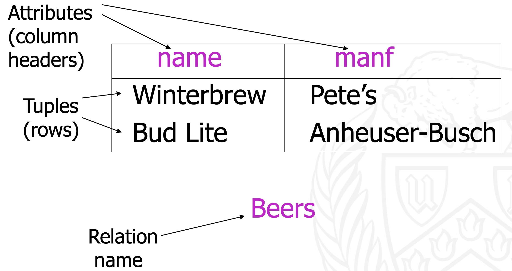

<!-- Use "{-}" if you want to exclude a heading in the numbering of headings -->

# Jason's CSE 560 Notes {-}
Hello to anyone reading this.  This is Jason Caballes' notes for CSE 560 :)

## Syllabus

### Piazza
[Click here for the piazza!](https://piazza.com/buffalo/spring2024/cse460560)

### Zoom Link
[Click here for the zoom link!](https://buffalo.zoom.us/my/sreyasee?pwd=Mlg4bmEyMGNJQVhhcUJqV3dkSFdCdz09)

### Class Weighting

| Segment | Weight |
|:-------:|:------:|
| Semester Projects | 20% |
| Class Activities | 10% |
| Weekly Quizzes | 10% |
| Midterm One | 20% |
| Midterm Two | 20% |
| Final | 20% |

### Exam Schedule
| Exam | Time |
|:----:|:----:|
| Midterm One | Wednesday, March 6th, 2024, from 18:30-22:00 |
| Midterm Two | Tuesday, April 9th, 2024, from 18:30-22:00 |
| Final | Monday, May 13th, 2024, from 19:15-22:15 in Norton 190 |


<!--chapter:end:index.Rmd-->

---
site: "bookdown::bookdown_site"
documentclass: "book"
output:
  bookdown::bs4_book: "default"
---
#  Relational Databases
## What is a data model?
A data model is an abstract model to describe a collection of data and how we can interact with it.  Data models can also be represented mathematically. For example

- Relational Models $\rightarrow$ Tables
- Semi-structured Models $\rightarrow$ Trees/graphs (Think of XML and HTML files)

Data models contain three parts:    

1. Structure of Data - How is data organized?
2. Operation on Data - What actions can we commit to the data?
3. Constraints on Data - What rules are applied to the data?

\

## The Relational Data Model
There are two mainstream types of data models:

1. Relational Models
2. Semi-structured Models

___This course will primarily focus on Relational Models.___

Data is organized in a two-dimensional table called a relation and have a series of operations based off relational algebra that can be applied to the table.  Relational models also include object-relational models that add storage to non-primitive objects and methods for tables.

Why do we use relational models?  Relational models are simple and intuitive to use.  They are also the models that underlie SQL.

\

### Relational Models: Structure, Operations, Constraints
__Column headers__ are called __attributes__ and they describe the information being provided for that column.  The __relation schema__ describes the name of a relation and the set of all attributes (and possibly with their data types) for the relation.

__Attributes in__ a __schema__ are a __set__ and __NOT__ a list (all values are unique and order does not matter).  On the other hand, when creating a relation schema, the order of attributes matter.  

   

The rows of a __relation__ are called __Tuples__ where each value for each attribute for the tuple is called the __component__ of that attribute.  Tuples have one component for each attribute provided by the schema.   In practice, we start a relation name with a capital letter and attributes with a lowercase letter.   The __domain__ of an attribute/component is the __data type__ associated with it.  __All domains__ must be of __atomic__ (primitive) data types.  

Relations are sets of tuples and therefore all tuples in a relation are unique and the order of the tuples does not matter.

A __subset of tuples__ from a relation is known as an __instance of that relation__.   We can reorder attributes and therefore, the components of an instance's tuples, however changing the order of a relation's schema changes the default attribute order of new instances of that relation. 

Database systems store a relation instance that mimics the relation's schema.  This is instance is known as the __current instance__.   Past versions of the current instance are called __temporal instances__

Finally, the __set of schemas for relations__ in a database is know as a "__Database Schema__". 

{width=100%}

\

### Relation Keys
A set of attributes in a relation form a __key__ if we do not allow two tuples in a relation to have the same values for that set of attributes,  that is, for each tuple, their components must be unique to all other tuples for the attributes assigned to be a key.  If a set of attributes is a key for a relation, then the same set of attributes must be a key for all instances of that relation.  Keys are pretty common in industry and many real-world databases use artificial keys (think UB person Number).

In database systems, relations can have one primary key.  Primary keys can have `NULL` as a value for a one of its components provided that you allow the relation to do so.

\

## Expressing Tables without Relational Algebra and SQL

In this section, we will notation for expressing relations.

To express a relation, we will first declare its name (remember that the first letter is capitalized), then we will declare its attributes surrounded by parentheses.  Any attributes that are underlined indicates that that attribute is part of the relation's key.

For example:

\

$$
Movies(\underline{name}, date, genre)
$$

\

In this example, the relation's name is $Movies$.  $Movies$ has three attributes ($name$, $date$, $genre$).  $name$ is a key for this relation.


<!--chapter:end:01-Relational-Databases.Rmd-->

---
site: "bookdown::bookdown_site"
documentclass: "book"
output:
  bookdown::bs4_book: "default"
---

```{r Connection to University Database, message=FALSE, warning=FALSE, include=FALSE}
library(DBI)
library(RSQLite)
conn <- dbConnect(RSQLite::SQLite(), "databases/University_Database.db")
```
# Relational Algebra
## Algebraic Query Language
SQL is built upon relational Algebra and is simplified for optimization and ease of use.  In relational algebra, relations are variables and finite relations are constants.  In other words, relations are the operands (things we apply operators to) in relational algebra.

When Database Management Systems (DBMS) process queries,  the first thing the system does is translate the queries into relational algebra or a very similar internal representation of it.

We will talk about the following operations in that can be done in relational algebra:

1. __Selection $\sigma_{C}{(R)}$__ - This operation chooses a subset of tuples.  $C$ is a set of conditions that determines which tuples are chosen and $R$ is the input of $\sigma$ that indicates which relation we want to execute the selection on.    
2. __Projection $\pi_{A_{1}, A_{2}, ...}$__ - This operation choose a subset of columns.  Each $A_{i}$ in the subscript is simply the attributes we want to project (select).  In relational algebra of sets, duplicate tuples are always removed.    
3. __Cartesian Products/Joins  $R \times S$__ - This concatenates two tuples together.  Conventionally, the attributes of in the left side of $\times$ are populated first.
4. __Renaming $\rho_{S{(A_{1}, A_{2}, ..., A_{n})}}{(R)}$__ - This changes the names of attributes or relations in the relation schema.  $R$ is the relation whos name we are trying to change, $S$ is the new name of $R$, and $A_{1}, A_{2},..., A_{n}$ are the attribute with their corresponding new names.  The attributes are listed in order of their definition in the relation's schema.  If you do not want to change some attributes, just list their current names in the subscript along with the new names of the attributes you wanted to change.

When joining relations together, we typically also apply the fundamental operations from set theory:   
1. __Unions $R \cup S$__ - This is the set of elements in R or S or both.  If an element appears in both, it is presented only once in union    
2. __Intersection $R \cap S$__ - This is the set of elements in both R and S    
3. __Difference $R - S$ (R not in S)__ - This is the set of elements in R, but not in S.  Note that this is different from $S - R$, which means the set of elements in S, but not in R.

When applying these operations to two tables, we implement some constraints:   
1. R and S must have schemas with identical attributes and the domains for each attribute must be the same in R and S   
2. Before doing any operations, the columns in R and S must be orderd so that the order of attributes are the same for both relations.  We cannot do operations on $R = \{Int, Char\}$ to $S = \{Char, Int\}$.  If attributes are identical between two relations, but they have different names, we can still apply this operations to the relations.  This is because we can just rename the attributes.

We will now go in more depth with each operation.

\

Before we talk about the various operations in relational algebra, we will define what a clause and predicate is.

__Clause__:  A clause is any function or keyword in SQL that allows you to filter tuples
__Predicate__:  A predicate is anything that returns a boolean (True, False, Unknown)

](images/clause_graph.png){width=100%}

## Selection
__Selection__ chooses which attributes we want in our relation.  For example:

```{sql Selection, connection=conn, max.print=5}
SELECT *
FROM instructor
```

The notation for selection is $\sigma_{C}({R2})$.  $C$ is the the set of conditions we may want to apply to the selection.  The input $R2$ is the relation we like to pull the attributes from. When committing any operator to a relation, we usually assign expression to a new relation.  For example:

$$
R1 := \sigma_{C}({R2})
$$

Here $R1$ is the new relation from the expression  $\sigma_{C}({R2})$.  $:=$ is an assignment operator that assigns $R1$ to be the relation returned from $\sigma_{C}({R2})$.  When creating relations from any expression, it will have the same schema as the inputted relation.  To put our expression in English, we are selecting all tuples.  We are not using any conditions to exclude tuples!

## Projection

__Projection__ selects a subset of attributes from a relation.  The order of attributes must be specified or the order of the relation from the schema is returned.  Any duplicates are eliminated.

$$
R1 := \pi_{L}({R2}) \\ \text{L - List of attributes from R2} \\ \text{In English - R1 is the the attributes "L" from R2}
$$

```{sql Projection, connection=conn, max.print=5}
SELECT name
  ,dept_name
  ,salary
FROM instructor
```


### Extended Projection
We can create attributes for a projection by applying operations to attributes.  Think of adding a constant to component of every tuple. or finding the difference between two columns as a new column.

For example:

$$
R = \begin{matrix}
A & B \\
\hline
1 & 2 \\
3 & 4
\end{matrix}
\qquad \text{Some relation } R
\\~\\~\\ % ~ is an operartor to add multiple new lines
R2 := \pi_{A+B\rightarrow{C}, A, B}({R}) \qquad \text{Assigning a new relation } R2 \text{ with  columns } A, B, C
\\~\\
C \text{ is a column generating in the projection by the expression } A + B \rightarrow{C}
\\~\\
R2 = \begin{matrix}
A & B & C \\
\hline \\
1 & 2 & 3 \\
3 & 4 & 7 \\
\end{matrix}
$$

\

## Cartesian Products and Joins
### Cartesian Product
Other names for cartesian product are "product" or "Cross product".  To denote the cartesian product for two relations, we use $\times$

For example:

$$
R3 := R1 \times R2
\\~\\
\text{In English, R3 is assigned to be the cartesian product of } R1 \text{ and } R2
$$

Cartesian product simple takes the the attributes in the left hand of $\times$ and concatenates it with the attributes in the right hand of $\times$.  The attributes in the left hand side appear first by convention.  If an attribute name appears in both relations, you must rename them.  $R3$ has the schema of both $R1$ and $R2$.

### Natural Joins
Natural Joins connect two relations by doing the following:

- Check which attributes in the schemas for both relations have the same name and domain
- For each tuple in one relation, compare the same attributes to the tuples in the other relation
- If both tuples have equal values for all shared attributes, concatenate the tuples!
  - If at least one of the shared attributes do is not equal in both tuples, reject the join of those tuples!
  - Any tuple that cannot join is known as a __dangling tuple__
- Any tuples shared attributes only appear once in the tuples (no duplicate attributes)

Natural joins are denoted as $\bowtie$

Lets take the following for an example:

Suppose we have two relations

$$
Sells = \begin{matrix}
bar & beer & price \\
\hline
Joe's & Bud & 2.50 \\
Joe's & Miller & 2.75 \\
Sue's & Bud & 2.50 \\
Sue's & Coors & 3.00
\end{matrix} \qquad Bars = \begin{matrix}
bar & address\\
\hline
Joe's & \text{Maple Street }\\
Sue's & \text{River Road} \\
\end{matrix}
$$

Lets join them!

$$
BarInfo := Sells \bowtie Bars
\\
\text{In English: Relation BarInfo is Sells natural join Bars}
\\~\\
BarInfo = \begin{matrix}
bar & beer & price & address \\
\hline \\
Joe's & Bud & 2.50 & \text{Maple Street} \\
Joe's & Miller & 2.75 & \text{Maple Street} \\
Sue's & Bud & 2.50 & \text{River Road} \\
Sue's & Bud & 2.50 & \text{River Road} \\
\end{matrix}
$$

### Theta Joins
A theta join is a cartesian product with a condition.  You simply commit a cartesian product that removes tuples based on some set of conditions.  The notation for a theta join is $\sigma_{C}$ where $C$ is the set of conditions.  Theta joins are called theta joins because historically, we used $\theta$ instead of $C$ to represent the set of conditions.

For example:

$$
R1 = \begin{matrix}
A & B \\
\hline
1 & 2 \\
3 & 4
\end{matrix} \qquad
R2 = \begin{matrix}
B & C \\
\hline
5 & 6 \\
7 & 8 \\
9 & 10
\end{matrix}
\\~\\~\\
R1 \times R2 = \begin{matrix}
A & R1.B & R2.B & C \\
\hline
1 & 2 & 5 & 6 \\
1 & 2 & 7 & 8 \\
1 & 2 & 9 & 10 \\
3 & 4 & 5 & 6 \\
3 & 4 & 7 & 8 \\
3 & 4 & 9 & 10 \\
\end{matrix}
\\~\\~\\
R5 := R1 \times_{A + C < 10 \text{ and } A < 2} R2 = \begin{matrix}
A & R1.B & R2.B & C \\
\hline
1 & 2 & 5 & 6 \\
1 & 2 & 7 & 8 \\
3 & 4 & 5 & 6
\end{matrix}
$$


### Self Joins

## Renaming
The rename operation simply renames relations or its attributes.  After renaming a relation, the returned relation retains its tuples, but with different names.

## Complex Expressions

## Sequence (Order) of Operations

## Expression Trees

## Schemas for Results

## Relational Algebra on Bags
### Operations on Bags

<!-- Continue on slide 10 of relational algebra lecture -->
<!---
### Natural Joins - $R \bowtie S$
If at least one component in a tuple in R is equal to a component in S, then the tuples can be a natural join.   The equivalent component will only appear once.  A tuple that fails to pair with any tuple of another relation in a join is know as a _dangling tuple_

### Theta Joins - $R \bowtie_{C} S$
Theta joins are simply natural joins with a condition.  To implement a theta join, simply do a natural join and remove tuples that do not satisfy your provided conditions.  Theta joins are called theta joins because the conditions were originally represented by $\theta$.   
--->

<!--chapter:end:02-Relational-Algebra.Rmd-->

---
site: "bookdown::bookdown_site"
documentclass: "book"
output:
  bookdown::bs4_book: "default"
---

# Introducion to SQL
## Defining Relationship Schemas in SQL
The current standard for SQL is __SQL-99__.  There are two aspects to SQL:    
1. The __Data-Definition__ to declare database schemas    
2. The __Data_Manipulation__ sub-language for querying/modifying databases 

### Why SQL?

## Relations in SQL
SQL makes a distinction between three kinds of relations:   
1. __Stored relations__, which are called __tables__    
2. __Views__, which are relations designed by some computation.  This relations are not stored, but constructed when needed   
3. __Temporary Tables__ which are constructed by the SQL language processor when executing queries and data modifications.  These relations are not stored and discarded when no longer used.   

To declare a schema for a stored relation, do the following

```
CREATE TABLE -- SOME TABLE NAME --
```

## Operational Semantics

## Foreign Keys

## Relation Schema Modification

## SELECT Cause

## DISTINCT

## WHERE

## FROM

## RENAME

## Patterns
### Like

## Null

## Multiple Relational Queries

## Joining Two Relations

## Explicit Tuple-Variables

## Self-Joins

## Subqueries

## Set Operations

## Single-Tuple Subquery

## Query + Subquery

## Between

## In

## Exists

## Any

## Except

## Union, Intersection, Difference

## Recursive Queries

## Bag Semantics

## Controlling Duplicate Elimination
### Data Types
The following are primitive data types that are supported by SQL    

#### Character Strings
They can be of fixed or variable length.  To type a fixed length character string, use `CHAR(n)` for some length $n$.  To create a variable length character string, use `VARCHAR(n)` for some length $n$.  If a component of a tuple with a domain of `CHAR(n)` is given and the length of the component is less than $n$, the component is padded with white space. 

#### Bit Strings
Bit strings can be of fixed or varying length. This data type is analogous to character strings, but their values are strings of bits rather than characters.

#### BOOLEANs
Booleans denote an attribute whose value is logical.  The possible values that a boolean can take are __TRUE, FALSE, UNKNOWN__.

#### INTs
Ints or (Integers) denote some integer value.  `SHORTINT` is also an int but is may have less bits.

#### Floating-Point Numbers
Floating points are denoted by `FLOAT` or `REAL`.  If you would like higher precision with floats, use `DOUBLE PRECISION`.  Like character strings, floats can be of fixed decimal length.  You can declare decimal length but calling `DECIMAL(n, d)` where $n$ is the total number of digits allowed for the float nad $d$ is the number of digits passed the decimal. 

#### Dates and Times
Dates and times are declared using `DATE` and `TIME` respectively. Dates and times are a special form of character strings.  Adding a string after the `DATE` declaration specifies the format of the date.  For example `DATE '1948-05-14'` creates a date value with the form "YYYY-MM-DD".  The same can be done with time.  For example `TIME '15:00:02.5'` specifies that you want to represent time with the format "HH:MM:SS" with the attachment of milliseconds. 

The follow is a simple example of a Relation Schema declaration

```{sql}
CREATE TABLE Movies(
  title CHAR(100) -- Character string with 100 characters
  ,year INT
  ,lengh INT
  ,genre CHAR(10)
  ,studioName CHAR(30)
  ,producerC# INT
);
```

### Modifying Relation Schemas
To delete or "drop" a table from a database, execute the following    

```{sql}
DROP TABLE -- SOME TABLE --;
```

When dropping at able, the table no longer exists in the database schema.  To modify and existing table, use the `ALTER` keyword   

```{sql}
---- Modifying a table to add a new attribute to its schema ----
ALTER TABLE -- SOME TABLE -- ADD -- SOME ATTRIBUTE -- CHAR(16); 

---- Modifying a table to remove an attribute from its schema ----
ALTER TABLE -- SOME TABLE -- DROP -- SOME ATTRIBUTE IN SCHEMA --; 
```

### Default Values
When adding a new attribute to a relation's schema, all tuples require some value for that attribute.  Database systems will default that value to `NULL`, but what if you want a specific value for it default to?  What if data is uploaded randomly and not all tuples have values for each component?   In this case we can use the `DEFAULT` keyword to add a specific value instead using `NULL`.

```{sql}
---- Creating attributes and adding a default value when no data is made available ----
gender CHAR(1) DEFAULT '?'
name VARCHAR(10) DEFAULT 'No Name :('
```

#### Declaring Keys
There are two ways to assign a set of attributes to be a key.  Keys are defined in the declaration of the database schema, i.e. the  `CREATE TABLE` statement.

Use `PRIMARY KEY` or `UNIQUE` to declare a set of attributes to be a key.  Remember, that keys must always be unique for each tuple.  The difference between `PRIMARY KEY` and `UNIQUE` is that components a tuple are allowed to have `NULL` as a value when using `UNIQUE`.  On the other hand, using `PRIMARY KEY` does not allow `NULL` to be in a key.

```{sql}
---- Assigning name as a primary key ---
CREATE TABLE MovieStar(
  name CHAR(30) PRIMARY KEY
  ,address VARCHAR(255)
  ,gender CHAR(1)
  ,birthdate DATE
);

---- You can assign keys after declaring all attributes as well! ----
CREATE TABLE MovieStar(
  name CHAR(30)
  ,address VARCHAR(255)
  ,gender CHAR(1)
  ,birthdate DATE
  PRIMARY KEY (name)
);
```

## Constraints

<!--chapter:end:03-Intro-Sql.Rmd-->

